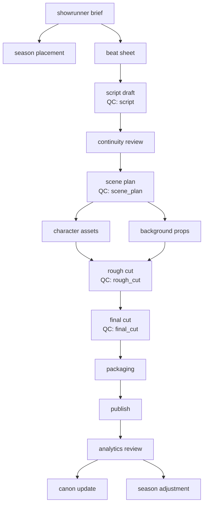

# Orchestration

The pipeline is declared as data in `anime_pipeline/app/services/orchestrator.py`
(`PIPELINE`), not as branching code. Everything below is generated from or
verified against that declaration, so the docs cannot drift from the runtime.

Inspect the live graph without reading code:

```
GET /pipeline/stages     # every stage, its agent, schema, dependencies, gates
GET /pipeline/agents     # the 13 registered agents
GET /pipeline/qc-model   # category weights and the publish threshold
GET /pipeline/diagram    # this diagram, as mermaid
```

## Episode graph



## Stage table

| Stage | Agent | Output schema | Approval | QC gate |
|---|---|---|---|---|
| showrunner_brief | executive_showrunner | episode_brief_v1 | yes | — |
| season_placement | season_planner | episode_brief_v1 | — | — |
| beat_sheet | episode_story | beat_sheet_v1 | — | — |
| script_draft | scriptwriting | script_draft_v1 | — | **script** |
| continuity_review | continuity | continuity_report_v1 | yes | — |
| scene_plan | storyboard_scene_planning | scene_plan_v1 | — | **scene_plan** |
| character_assets | character_asset | asset_request_v1 | — | — |
| background_props | background_props | asset_request_v1 | — | — |
| rough_cut | edit_motion | scene_plan_v1 | — | **rough_cut** |
| final_cut | edit_motion | scene_plan_v1 | yes | **final_cut** |
| packaging | packaging | packaging_v1 | yes | — |
| publish | edit_motion | packaging_v1 | yes | — |
| analytics_review | analytics_optimization | analytics_report_v1 | — | — |
| canon_update | series_bible | episode_brief_v1 | — | — |
| season_adjustment | season_planner | episode_brief_v1 | — | — |

`character_assets` and `background_props` share a `parallel_group`, as do
`canon_update` and `season_adjustment`: both pairs may run concurrently.

## Task state machine

```
queued -> in_progress -> waiting_for_review -> approved -> (dependents unlock)
                      -> completed              (when no approval is required)

in_progress        -> blocked | failed
waiting_for_review -> needs_revision -> queued
```

A dependency is satisfied only by `approved` or `completed`. Everything else
leaves the dependent stage waiting.

## Gating rules

1. **Dependencies.** A stage starts only when every stage it depends on is
   approved or completed.
2. **QC gates.** If a dependency declares a `qc_gate`, the latest report for
   that stage must also have no critical issues and no outstanding mandatory
   fixes. Intermediate gates deliberately do *not* require `publish_ready` —
   only a final-cut report can ever be publish-ready, so requiring it earlier
   would deadlock the pipeline before it reached the final cut.
3. **Blockers.** Any unresolved blocker freezes every stage on the episode.
4. **Publishing.** `final_cut` and `packaging` must be approved *and* the
   latest final-cut QC report must be publish-ready. See
   [02-qc-framework.md](02-qc-framework.md).

## Events

`POST /webhooks/events` with `{"event": ..., "payload": {"episode_id": ...}}`.

| Event | Effect |
|---|---|
| `episode.created` | Opens the graph; `showrunner_brief` becomes runnable |
| `task.completed` | Routes to `waiting_for_review` or `completed` by stage |
| `task.failed` | Retries up to `max_retries`, then escalates |
| `approval.granted` | Marks approved; unlocks dependents |
| `approval.rejected` | Marks `needs_revision`; opens the revision loop |
| `qc.reported` | Stores the report and re-evaluates that stage's gate |
| `blocker.raised` / `blocker.resolved` | Freezes / thaws the episode |

Unrecognised events are ignored rather than raising, so a new webhook source
cannot take the orchestrator down.

## Retry policy

| Failure | Behaviour |
|---|---|
| Schema validation | One repair retry with the validation error fed back to the agent; a second failure escalates |
| Provider timeout | Retry up to `max_retries` (default 2) |
| Missing dependency | `waiting_on_dependency`, no retry |
| Approval rejection | `needs_revision`, back to the queue |
| Blocker | `blocked`, escalate to the showrunner |

The repair retry lives in `AgentRunner`, which never stores output that failed
its schema — a downstream agent must not read a payload that broke its own
contract.

## Where the workflow state lives

`WorkflowState` in the orchestrator is a plain dataclass with no database
dependency, which is what makes the gates unit-testable. The webhook route
currently keeps those states in a process-local dict. **That is scaffolding, not
production behaviour**: it is per-process and lost on restart. Replace
`_load_state` / `_save_state` in `app/api/routes/webhooks.py` with repository
calls before running more than one worker.

## n8n / LangGraph

Either can drive this. The stage table above is the node list; the gating rules
are the conditional edges. Whichever you use, keep the graph declaration in
`PIPELINE` as the single source of truth and have the workflow tool call
`/pipeline/stages` rather than re-encoding the DAG — two copies of a dependency
graph diverge quickly.

Split n8n into five workflows rather than one: `episode_intake`,
`writing_pipeline`, `planning_pipeline`, `production_pipeline`,
`analytics_pipeline`. One giant workflow is hard to re-run from the middle,
which is exactly what a revision loop needs to do.
